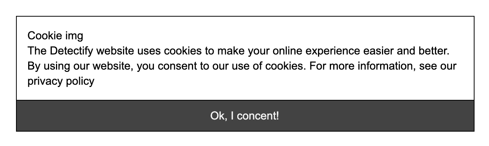

# Vue Life Cycle Hooks övningar

## Instruktioner

**Övning 1**

**Life Cycle Hook:** beforeMount()

Gör en komponent ( <gdpr /> ) som bara visas första ggn man laddar sidan. Spara compliance i localStorage. Om localstorage.getItem(‘gdpr’) existerar ska inte GDPR visas.



**Övning 2**

**Life Cycle Hook:** Mounted()

1. Registrera dig för en API - key [här](https://www.potterapi.com/).

2. Hämta alla karaktärer och presentera dessa snyggt i en komponents view.

**API endpoint:** ```/characters```

3. När jag klickar på en karakäter ska mer info om denna visas.

**API endpoint:** ```/characters/{characterId}```